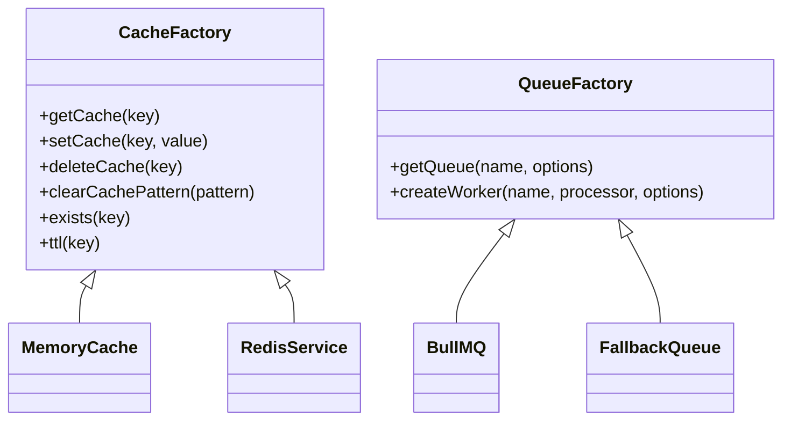

# Updated Dependency Graph

## Enterprise Architecture Target

```mermaid
graph TD
    Server[server.js] --> App[app.js]
    
    App --> AuthRoutes[api/routes/auth.routes.js]
    App --> QueueMgr[services/queues/queueManager.js]
    App --> CommWorker[services/workers/communicationWorker.js]
    
    AuthRoutes --> AuthGuard[guards/auth.guard.js]
    
    QueueMgr --> QueueFactory[services/queues/queueFactory.js]
    CommWorker --> CommQueue[services/queues/communicationQueue.js]
    CommQueue --> QueueFactory
    
    AuthGuard --> CacheFactory[services/cache/cacheFactory.js]
    QueueFactory --> CacheFactory
    
    CacheFactory -->|CACHE_PROVIDER=memory| MemoryCache[services/cache/memoryCache.service.js]
    CacheFactory -->|CACHE_PROVIDER=redis| RedisService[services/cache/redis.service.js]
    
    QueueFactory -->|QUEUE_PROVIDER=fallback| FallbackQueue[services/queues/communicationQueue.js (FallbackLogic)]
    QueueFactory -->|QUEUE_PROVIDER=bullmq| BullMQ[bullmq Package]
```

## Factory Architecture Diagram

