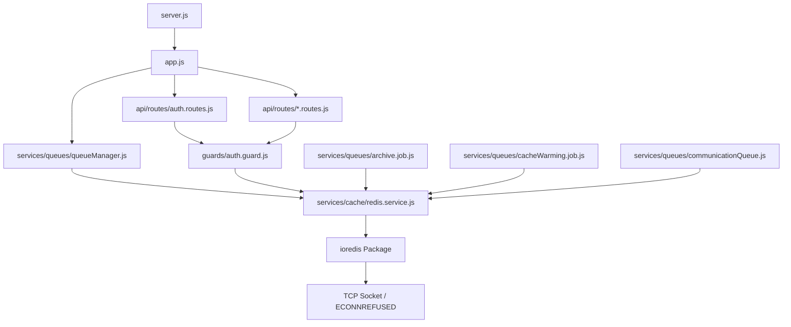

# Enterprise Runtime Investigation: Redis Connection Error

## 1. Root Cause
The `ECONNREFUSED 127.0.0.1:6379` error is caused by a persistent, non-configurable `ioredis` connection attempt originating from the core authentication guard. Even though the application supports a "Redis-free" local development mode for queues (falling back to an in-memory queue), the **Auth Guard** forces the initialization of the cache service immediately on application startup, which in turn unconditionally creates a Redis connection. Because `ioredis` automatically retries failed connections indefinitely by default, the application continually spams the `ECONNREFUSED` error.

## 2. Exact Locations

* **Exact File:** `backend/src/services/cache/redis.service.js`
* **Exact Function:** Module initialization (top-level execution).
* **Exact Line (Socket Creation):** Line 8: `redisClient = new Redis(process.env.REDIS_URL);`
* **Exact Line (Error Logging):** Line 18: `console.error('❌ Redis Cache Connection Error:', err.message);`
* **Exact Line (REDIS_URL Logging):** Line 6: `console.log("REDIS_URL:", process.env.REDIS_URL);`

## 3. Execution Timeline & Call Stack

```text
server.js (Line 18)
↓ requires
app.js (Line 73)
↓ requires
api/routes/auth.routes.js (Line 7)
↓ requires
guards/auth.guard.js (Line 4)
↓ requires
services/cache/redis.service.js
↓ executes top-level code
new Redis(process.env.REDIS_URL)
```

## 4. Why it still executes
The application has implemented resilient "Fallback Queues" in `communicationQueue.js` and wrapped Queue initializations in `try/catch` blocks in `queueManager.js` to support Redis-free development. However, **`auth.guard.js` directly imports `redis.service.js` to utilize the `getCache` and `setCache` functions for user permissions**. Because `auth.guard.js` is imported globally by virtually all route files in `app.js`, the cache service is always instantiated synchronously on startup. The `try/catch` block inside `redis.service.js` only catches module resolution errors (e.g., if `ioredis` is missing from `node_modules`), but it **does not catch connection errors**, as connection attempts in `ioredis` happen asynchronously in the background. Thus, the client is successfully instantiated, and the internal retry loop begins.

## 5. Dependency Graph



## 6. Duplicate Implementations & Direct Imports

* **Cache Factory:** There is **NO** `cacheFactory.js` or `memoryCache.service.js` in the repository. Modules directly import the Redis service.
* **Duplicate Redis Implementations:**
  1. `backend/src/services/cache/redis.service.js` (**RUNTIME - Active**)
  2. `backend/src/services/redis.service.js` (**DEAD CODE** - Imported only by `cache.middleware.js`, which is unused).
* **Direct BullMQ Imports:** 
  Modules directly import BullMQ rather than using a centralized `queueFactory`. 
  - `queueManager.js`
  - `communicationQueue.js`
  - `archive.job.js`
  - `cacheWarming.job.js`

## 7. Component Matrix

| File | Reason | Imports | Creates Redis? | Creates Queue? | Runtime? | Dead code? | Severity |
|---|---|---|---|---|---|---|---|
| `cache/redis.service.js` | Central Redis initialization | `ioredis` | **YES** | NO | YES | NO | HIGH |
| `redis.service.js` (root) | Duplicate implementation | `ioredis` | **YES** (in code) | NO | NO | **YES** | LOW |
| `auth.guard.js` | Uses cache for permissions | `cache/redis.service` | NO | NO | YES | NO | HIGH |
| `queueManager.js` | BullMQ centralized dashboard/workers | `bullmq`, `cache/redis.service` | NO | **YES** | YES | NO | HIGH |
| `communicationQueue.js` | Event Bus fallback queue | `bullmq`, `cache/redis.service` | NO | **YES** | YES | NO | HIGH |
| `archive.job.js` | Background job | `bullmq`, `cache/redis.service` | NO | **YES** | YES | NO | HIGH |
| `cacheWarming.job.js` | Background job | `bullmq`, `cache/redis.service` | NO | **YES** | YES | NO | HIGH |
| `cache.middleware.js` | Caching layer for responses | `services/redis.service` | NO | NO | NO | **YES** | LOW |

## 8. Reconnect Loop Identification
The line responsible for the continuous reconnection loop is:
```javascript
// backend/src/services/cache/redis.service.js:8
redisClient = new Redis(process.env.REDIS_URL);
```
Because `maxRetriesPerRequest` and `retryStrategy` are not explicitly defined in this constructor, `ioredis` falls back to its default behavior: it will continuously attempt to reconnect with an exponential backoff strategy, indefinitely logging `Redis Cache Connection Error`.

## 9. Recommended Fix Plan (Documentation Only)

To fully implement a "Redis-free" development environment:

1. **Implement Cache Factory:** Abstract caching into a `CacheFactory` that returns either `redisCache.service` or `memoryCache.service` based on `process.env.USE_REDIS` or `process.env.NODE_ENV`.
2. **Update Auth Guard:** Refactor `auth.guard.js` to depend on the `CacheFactory` rather than directly importing `redis.service.js`.
3. **Disable ioredis Auto-Retry in Dev:** If `REDIS_URL` is provided but fails to connect, configure the `ioredis` retry strategy to stop after a maximum number of attempts (e.g., `retryStrategy: (times) => times > 3 ? null : Math.min(times * 50, 2000)`).
4. **Remove Dead Code:** Delete `src/services/redis.service.js` and `src/core/middlewares/cache.middleware.js` as they are unreferenced.
5. **Centralize Queues:** Prevent background jobs (`archive.job.js`, `cacheWarming.job.js`) from directly instantiating BullMQ queues. Route them through a unified `queueFactory.js`.
